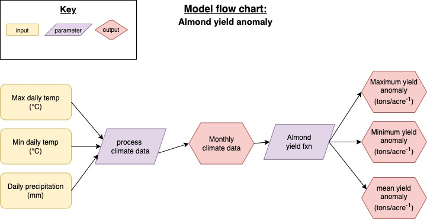

```{r setup, include=FALSE}
knitr::opts_chunk$set(echo = TRUE)
library(here)
library(tidyverse)
library(purrr)
```


### Overview

First, we created a diagram to represent our model for almond yield anomalies in response to climate. This included translating our inputs into outputs and determining which parameters will influence the relationship between the inputs and outputs. 




### Read in and wrangle data
First we'll read in our `clim.txt` data file, which provides daily precipitation as well as minimum and maximum temperatures. 
```{r}
clim_df <- read_table("clim.txt") %>% 
  ### remove quotes in names
  janitor::clean_names()
```


Next, we'll create a data subset with the total precipitation and absolute minimum and maximum temperatures for each month. Then, we'll form two subsets for use in the almond yield function: one with minimum February temperatures and another with the total January precipitation.
```{r}
### Find the absolute tmin and tmax
### as well as average precip for each month in dataset
clim_months <- clim_df %>% 
  group_by(month, year) %>% 
  summarize(tmax_max = max(tmax_c),
            tmin_min = min(tmin_c),
            precip_sum = sum(precip))


### Filter for min temps from Feb
tmin_feb <- (clim_months %>% filter(month ==2))$tmin_min 

  
### Filter for summed precip in Jan
jan_precip <- (clim_months %>% filter(month ==1))$precip_sum
```


### Run function to get yield anomalies

Finally, we'll source our function to find the yield anomalies for the given timeseries of climate data. 
```{r}
### Read in function
source("R/compute_almond_yield.R")

### Run function with climate data
yields <- almond_yield(tmin_feb, jan_precip)

yields
```

Given the climate data from 1989-2010, we see that the maximum yield anomaly for almond crops is `r yields$max_yield`, the minimum yield anomaly is `r yields$min_yield`, and the average yield anomaly is `r yields$mean_yield`.


### Informal Sensitivity Analysis
```{r}
### sample of tcoeff1 values
tcoeff1_samp <- rnorm(mean = -0.015, sd = 0.01, n = 20)

### use map from purrr
sens_test <- tcoeff1_samp %>% 
  map(~almond_yield(tmin_feb, jan_precip, tcoeff1 = .x))

head(sens_test)


### Try to extract just max yields df with purrr::map_df

sens_test_df <- map_df(sens_test, `[`, "max_yield")
sens_test_df
```


